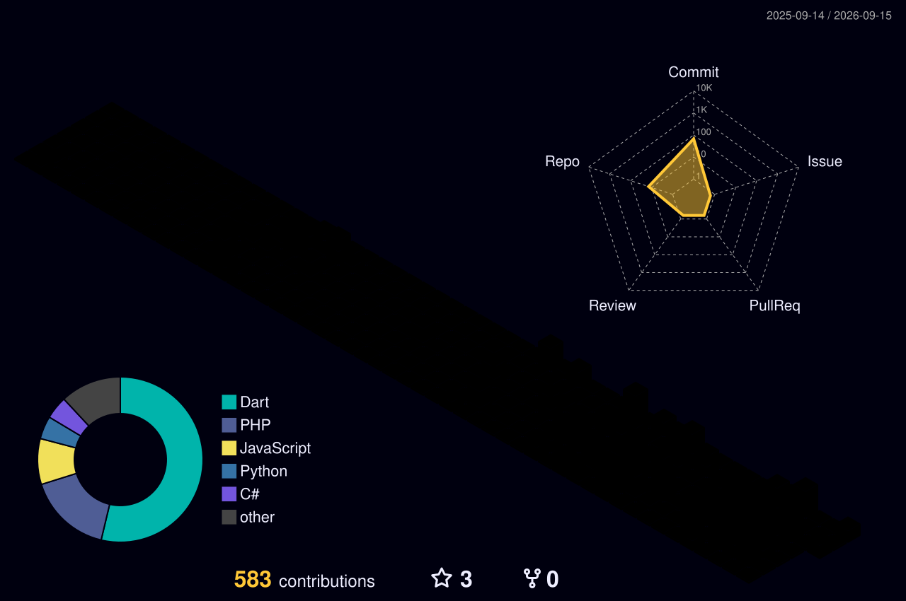

## 👨‍💻 About Me

I'm a **Software Engineer** who owns projects end-to-end — from planning and architecture, through documentation, all the way to production code. My core coding specialty is **Flutter**, but with AI-assisted workflows I've been able to grow beyond a single lane: system design, backend security, and full-stack thinking are now part of how I build.

Alongside that, I work as an **AI Integration / RAG Engineer**, designing retrieval-augmented generation pipelines and conversational AI systems — including Arabic-language RAG, which is a niche I particularly enjoy.

- 🧠 **Founder & Lead Developer** of **Aleefy** — a veterinary clinic management SaaS platform (private repo, architected from the ground up with Clean Architecture)
- 💼 **Experience:** Flutter Developer @ Connect Digital Agency · RAG Engineer @ Accordev · Freelance Flutter Developer
- 📚 **Currently learning:** deeper AI integration & prompt engineering, complex networking, and cybersecurity fundamentals
- 🎯 **Open to:** Flutter development & AI/RAG integration roles — freelance or full-time
- 📍 Damascus, Syria

## 🛠️ Tech Stack

**Mobile & Cross-Platform**

 

**Backend & APIs**

 

**Web**

 

**DevOps** 

 

**AI & NLP**

## 🚀 Featured Projects

<table>
<tr>
<td width="50%" valign="top">

### 🐾 Aleefy
**Veterinary Clinic Management SaaS**
`Flutter` `Laravel` `Clean Architecture`

Founder & lead developer. Digitizes paper-based clinic workflows — appointment lifecycle, centralized pet medical records, vaccination reminders, multi-clinic sync, and subscription management. Architected from the ground up for multi-tenant scalability.

🔒 *Private repo — in active development*

</td>
<td width="50%" valign="top">

### 📲 YASender
**Self-Hosted WhatsApp API**
`Python` `FastAPI` `Node.js` `Baileys`

Lets startups send OTPs and notifications over WhatsApp without paying for the official Business API. FastAPI + Baileys worker architecture, QR-based session auth, built-in anti-ban rate-limiting engine, and an admin dashboard.

</td>
</tr>
<tr>
<td width="50%" valign="top">

### 🏘️ Residential Booking Platform
**Role-Based Real Estate Booking App**
`Flutter` `Laravel` `JWT`

Supports Owners, Tenants, and Administrators with a full booking lifecycle (pending → confirmed → completed/declined/canceled), advanced filtering, localization, push notifications, and real-time messaging.

</td>
<td width="50%" valign="top">

### 🤖 Arabic Restaurant AI Assistant
**Conversational AI in Syrian Dialect**
`Python` `ChromaDB` `RAG`

Semantic retrieval assistant using multilingual Sentence Transformers + ChromaDB, with hybrid vector/exact-match retrieval and prompt engineering to reduce hallucinations and mitigate prompt-injection risks.

</td>
</tr>
</table>

## 📊 GitHub Stats

## 🧊 3D Contribution Graph

## 📬 Connect With Me

